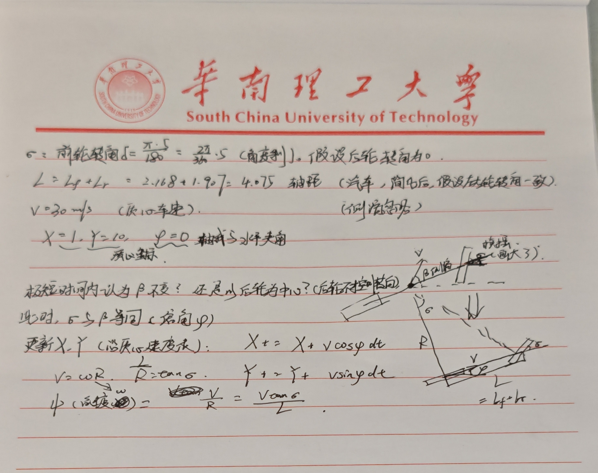

# 作业1：自行车模型与轨迹跟踪

先附上手写的推导过程：

## 文件说明

- bicycle_models_problem.m：运动学自行车模型的开环仿真；
- lane_follower.m：实现轨迹跟踪控制。

## 第一问

### 建模

低速（相对）情况下，汽车两个前轮的转角近似相等。（这也是能理想化成自行车模型的必要条件）
自行车模型下，一般不考虑轮胎侧偏、悬架、空气阻力、纵向加减速等动力学因素。（应该是这样？）
也是参考题目要求，就用课件里的自行车模型计算了。
最后我给自行车模型加了这些条件，方便我计算。

1. 前后轮分别合并为一个等效前轮和一个等效后轮；
2. 后轮不转向，仅前轮相对车轴有转角；
3. 使用后轴中心作为运动学更新的参考点，绘图时再根据lr换算出质心附近的位置。

### 推导过程

车辆轴距为L = lf + lr = 2.168 + 1.907 = 4.075 m（lf,lr是前后轮中心到车质心距离？）
以后轴中心为参考点，车辆瞬时转弯半径近似有
$$R = \frac{L}{tan \sigma}$$
又因为圆周运动有
$$v = \omega R$$
所以航向角速度为
$$phi_{dot} = \omega = \frac{v}{R} = v \frac{tan\sigma}{L}$$
最后更新位置
$$
phi_{k+1} = phi_k + phi_dot * dt,
X_{k+1} = X_k + v * cos(phi_{k+1}) * dt,
Y_{k+1} = Y_k + v * sin(phi_{k+1}) * dt
$$
和MATLAB里写的形式基本一样。
一开始在思考取后轮中心计算还是质心位置计算，然后发现质心位置的更复杂，遂转向后轮中心。

### 结果理解

当前轮转角$\sigma$恒定，曲率恒定，所以车辆沿圆周运动。代入参数求得
$$
R = \frac{4.075}{tan5\degree}  ≈ 46.6 m;
phi_{dot} = 30 / R ≈ 0.64 rad/s
$$
因此在开环仿真中，航向角会持续增加，轨迹表现为不断转向的圆弧轨迹。
就像骑自行车（这个模型里就当开赛车了），控制前轮相对车轴的方向不变，自然应该跑出圆形轨迹。

## 第二问：轨迹跟踪

第二问的运动学模型和第一问一样，只是把前轮转角$\sigma$从固定值改成由控制器实时计算（正弦）。
决定采用听了很久的PID进行追踪，流程大致如下：

1. 在参考轨迹上寻找离当前车辆位置最近的点。
2. 用车辆到最近点的距离作为跟踪误差$e$。
3. 用PID计算前轮转角$\sigma$；
4. 把$sigma$代入第一问的运动学模型，更新车辆状态，循环往复。

## 对当前跟踪算法的理解

这个 PID 版本的好处是很直观：距离轨迹越远，转向越大；误差变化越快，微分项会参与调整；误差长期存在时，积分项会继续推动车辆靠近轨迹。

让AI评价这段代码，挖出来一些可以改进的地方：

- 还没有显式利用参考轨迹的切线方向和车辆航向角误差；
- $\sigma$没做约束，PID参数偏大时容易出现不现实的大转角（起步时有一段貌似就是这样？）；
- 在速度较高或曲率较大的路径上，单纯的最近点距离PID不够稳定（当然这个任务的条件下足够了）。

## 学习记录

一开始我以为只是单纯套公式，但实际推导时发现，关键在于取何处为参考中心。
确定参考点后，手写推导直接从圆周运动关系入手：前轮转角决定转弯半径，转弯半径再决定航向角速度。这个公式本质上说明：车速越快、前轮角越大、轴距越短，车辆航向变化就越快。

代码实现时我也体会到离散积分的含义。连续模型写成微分方程很简洁，但仿真里必须用一个时间步$dt$一步一步更新状态。这里用的是最简单的欧拉积分，所以$dt$不能太大，否则轨迹会变粗糙甚至失真。

第二问让我意识到“能让车动起来”和“能稳定跟踪轨迹”不是一回事。最近点距离 PID 很容易实现，但它没有方向信息，所以控制量并不总是合理。真正的车辆路径跟踪需要考虑横向误差的符号、车辆航向和道路切线方向，这也是 Stanley、Pure Pursuit、MPC 这些方法存在的原因。

这次作业的收获是走了一遍车辆运动学模型到仿真控制的全流程。第一问解决车辆如何根据转角运动（开环，纯手操），第二问进一步尝试根据轨迹误差反过来决定转角（把调整交给程序完成）。

## 后续可以改进的地方

- 给$sigma$增加物理限幅，例如限制在$[-30\degree,30\degree]$（尽量贴近车的转向限位）。
- 把距离误差改成带符号的误差，直接区分车辆在轨迹左侧还是右侧。
  - 误差不带符号，车有可能在修正方位误差时冲过头，转变成正反馈，使PID失效。
- 加入航向误差，让车辆不仅靠近轨迹，还能沿着轨迹方向行驶。
- 尝试纯跟踪或Stanley Controller，与当前PID方法对比。
- 启用1-1中注释掉的动力学模型，比较运动学模型和动力学模型在高速下的差异。
